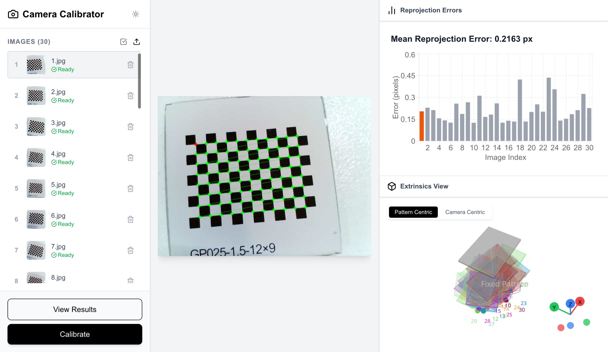

# Camera Calibrator

A modern, web-based tool for camera calibration built with Next.js and OpenCV.



## 🚀 Features

- **Web-Based Interface**: Clean, responsive UI built with Next.js and Tailwind CSS.
- **Robust Detection**: Utilizes a Python backend (FastAPI + OpenCV) for reliable chessboard detection and calibration.
- **Real-time Feedback**: Visualizes detected corners and reprojection errors.
- **Hybrid Architecture**:
  - **Frontend**: Next.js (React), Tailwind CSS. Deployed on GitHub Pages.
  - **Backend**: Python, FastAPI, OpenCV. Deployed on Hugging Face Spaces.
- **Fallbacks**: Robust error handling with fallback to specific backend endpoints.

## 🛠️ Architecture

This project uses a split architecture to combine the interactivity of a modern web app with the computational power of Python's OpenCV libraries.

- **Frontend (`/app`)**: Handles image upload, UI interaction, and result visualization.
- **Backend (`/hf_space`)**: A FastAPI service running inside a Docker container. It processes images, detects chessboard corners, and performs the camera calibration math.

## 🏁 Getting Started

### Prerequisites

- Node.js (v18 or higher)
- Python (v3.9 or higher) - for local backend development

### Local Development

#### 1. Frontend Setup

```bash
# Install dependencies
npm install

# Start the development server
npm run dev
```

The frontend will be available at `http://localhost:3000`.

#### 2. Backend Setup

To run the backend locally:

```bash
cd hf_space

# Create a virtual environment
python -m venv venv
source venv/bin/activate  # On Windows use `venv\Scripts\activate`

# Install dependencies
pip install -r requirements.txt

# Run the server
uvicorn app:app --reload --port 7860
```

#### 3. Connect Frontend to Backend

Create a `.env.local` file in the root of the project to tell the frontend where the backend is running:

```env
# For local development
NEXT_PUBLIC_BACKEND_API_URL=http://localhost:7860
```

## 📦 Deployment

### Frontend (GitHub Pages)

The frontend is automatically deployed to GitHub Pages via GitHub Actions.

1. The workflow is defined in `.github/workflows/deploy.yml`.
2. Ensure you have configured the **Repository Variable** `NEXT_PUBLIC_BACKEND_API_URL` in your GitHub Settings (Settings > Secrets and variables > Actions > Variables).
   - Value: `https://your-space-name.hf.space`

### Backend (Hugging Face Spaces)

The backend is designed to run on Hugging Face Spaces (Docker SDK).

1. Create a new Space on Hugging Face.
2. Select **Docker** as the SDK.
3. Push the contents of the `hf_space/` directory to the Space (or connect it to this repo).
   - *Note*: You can use the included `deploy_to_hf.sh` script if you have the Hugging Face CLI configured.

## 📄 License

This project is licensed under the MIT License - see the [LICENSE](LICENSE) file for details.
